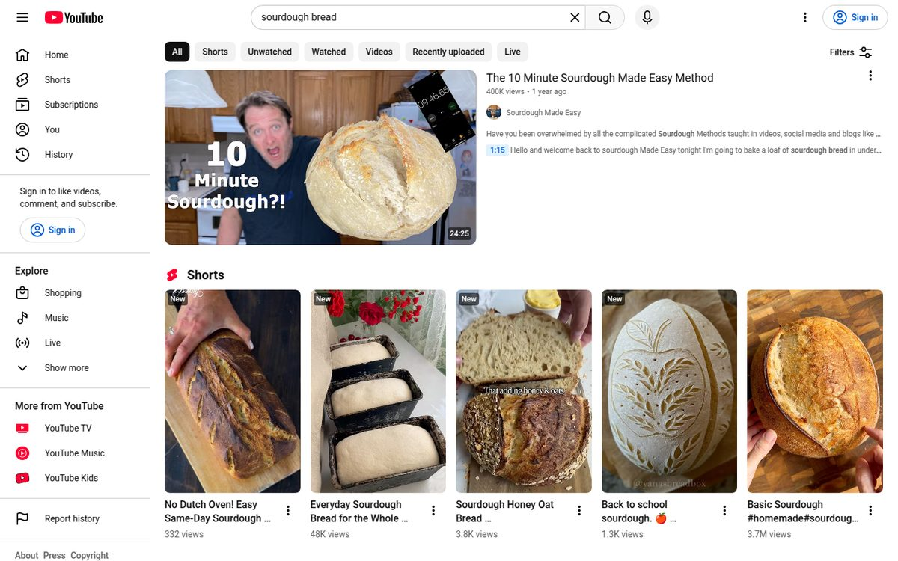
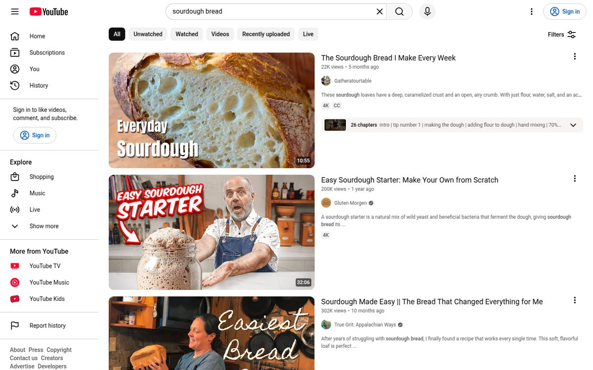
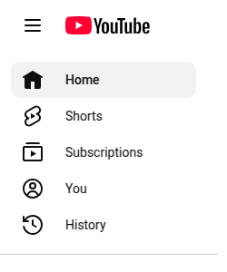
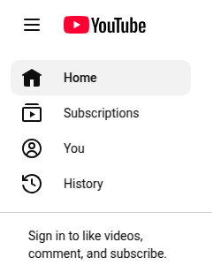
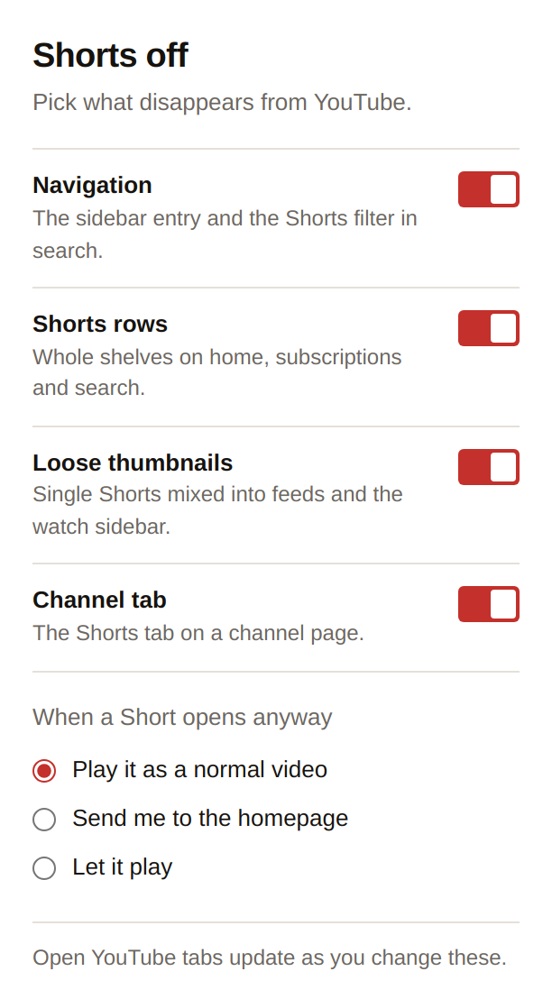

# Shorts Off for YouTube

A Manifest V3 Chrome extension that takes Shorts out of YouTube: the sidebar
entry, the search filter, the shelves, the loose thumbnails, the channel tab,
and the Shorts player itself.

| Before | After |
| --- | --- |
|  |  |

<p align="center">
  
  
</p>

## Star History

<a href="https://www.star-history.com/?repos=vincegher%2Fshorts-off-youtube&type=date&legend=top-left">
 <picture>
   <source media="(prefers-color-scheme: dark)" srcset="https://api.star-history.com/chart?repos=vincegher/shorts-off-youtube&type=date&theme=dark&legend=top-left" />
   <source media="(prefers-color-scheme: light)" srcset="https://api.star-history.com/chart?repos=vincegher/shorts-off-youtube&type=date&legend=top-left" />
   
 </picture>
</a>

## Install

1. Open `chrome://extensions`.
2. Turn on **Developer mode** (top right).
3. Click **Load unpacked** and select this folder.
4. Reload any open YouTube tab.

## Settings



| Setting | Removes |
| --- | --- |
| Navigation | The sidebar entry, the collapsed sidebar icon, the mobile pivot bar, and the Shorts filter chip in search |
| Shorts rows | Shorts shelves on home, subscriptions, search and channel pages |
| Loose thumbnails | Single Shorts mixed into feeds, search results and the watch sidebar |
| Channel tab | The Shorts tab on channel pages |
| When a Short opens anyway | Plays it on `/watch` instead, sends you home, or leaves it alone |

Settings live in `chrome.storage.sync`, so they follow your Chrome profile, and
open tabs pick up changes without a reload.

<br clear="all">

## How it works

`src/hide-shorts.css` does the hiding and ships as a `document_start` content
stylesheet, so Shorts never paint. Each group of rules is gated on the *absence*
of an attribute (`html:not([data-so-shelves="off"])`), which means hiding is
live before settings have been read; `src/content.js` only ever adds the "off"
markers afterwards.

`src/content.js` handles the parts CSS can't:

- Blanks a Shorts page at `document_start`, then redirects it. Targets are built
  from `location.origin`, so `m.youtube.com` stays on mobile.
- Tags the three surfaces that expose no URL to match on. The sidebar entry
  ships an `<a>` with no `href` at all, and channel tabs and filter chips carry
  no anchor, so the label is the only handle — "Shorts" is a product name and
  stays untranslated across YouTube's locales. Tagging is unconditional and
  idempotent; the stylesheet decides whether a tagged element is hidden.
- Re-runs on YouTube's client-side navigations, which fire no page load. It
  listens for `yt-navigate-start`/`yt-navigate-finish` and, as a backstop,
  compares `location.href` inside a debounced `MutationObserver`.
- Suspends the "loose thumbnails" rules while you're on a Short you chose to
  allow, otherwise that feed would be empty.

## Tests

```bash
npm install
npm test          # selector matrix + extension loaded in a real Chrome
npm run test:live # loads youtube.com and asserts nothing Shorts survives
```

- `tests/test-css.js` asserts each rule against mock markup, including
  lookalikes that must stay visible and every toggle switching its group off.
- `tests/test-e2e.js` loads the extension in Chrome against a stub served as
  `youtube.com`, and checks the redirect and the channel tab.
- `tests/test-live.js` hits the real site, counts visible Shorts with and
  without the extension, and writes the screenshots in `docs/`.

## Maintaining it

YouTube renames its custom elements every few months. When something reappears,
open devtools, find the element name, and add it to the matching block in
`hide-shorts.css` — the blocks are labelled by surface. Add the case to
`tests/test-css.js` at the same time; `npm run test:live` is the quickest way to
tell whether the current selectors still cover the live site.

## Known limits

- The redirect turns a Short into a regular `/watch` video. Some Shorts are
  portrait-only and will letterbox there; choose "Send me to the homepage" if
  you'd rather never land on one.
- Label matching assumes YouTube keeps calling it "Shorts" in your interface
  language, which it does in every locale I've seen.
- Sync storage is per Chrome profile, not per device.

## License

MIT
